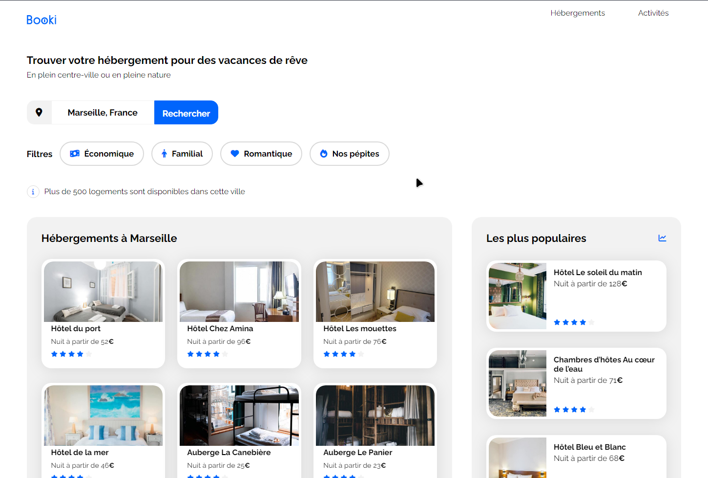
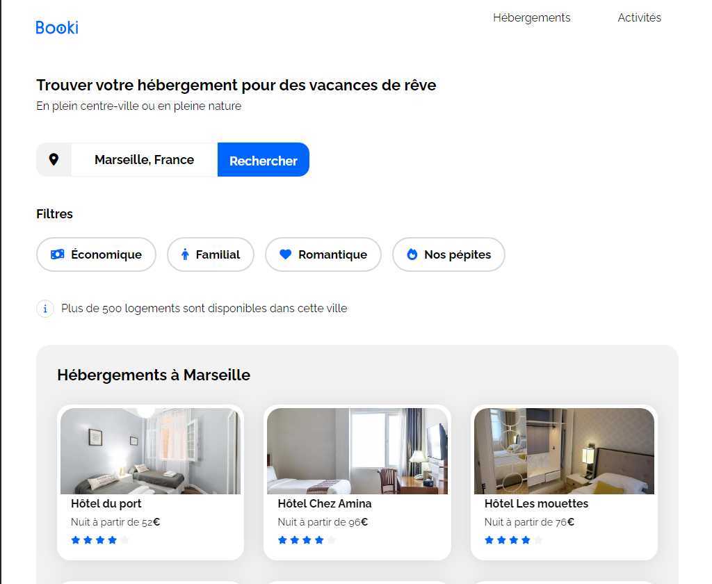
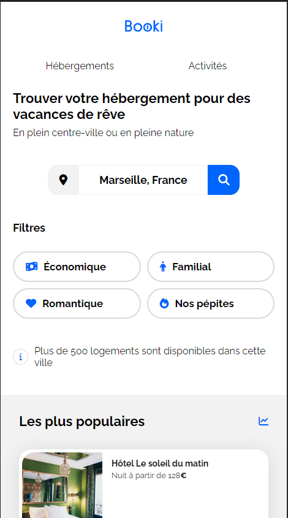

# Create a travel agency homepage with HTML & CSS

## Table of contents

- [Overview](#overview)
  - [The challenge](#the-challenge)
  - [Screenshot](#screenshot)
  - [Links](#links)
- [My process](#my-process)
  - [Built with](#built-with)
  - [What I learned](#what-i-learned)

## Overview

### The mission

- Integrate the interface of the site with HTML and CSS code using the designs provided.

### Screenshot

### Links

- Live Site URL: [Live Site](https://frabjous-lolly-2f6960.netlify.app/)

## My process

### Built with

- Semantic HTML5 markup
- CSS custom properties
- Flexbox

### What I learned
